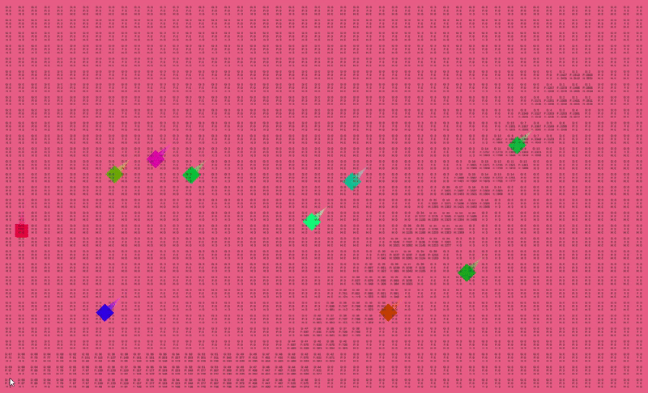

# AI State Machine

This project was developed as part of a revision for the AI Programming exam at the I.T. University of Copenhagen. 

## Concept

The primary objective was to develop an AI system that can dynamically switch between different states; such as Roam, Seek, Avoid, and Flee - while navigating an environment using a variety of movement techniques and pathfinding algorithms.

## Features

- **Dynamic State Management**: Implements a modular State Machine AI, allowing agents to switch between states such as Roam, Seek, Avoid, and Flee, based on environmental triggers and internal conditions.
- **Pathfinding Algorithms**: The system utilizes both the **A*** algorithm and **Dijkstra's algorithm** for pathfinding, providing robust solutions for navigating complex environments. Additionally, it allows for different forms of distance cost calculations, including **Manhattan**, **Euclidean**, and **Chebyshev** distances.
- **Multiple Movement Techniques**: Supports a range of movement methods including Static, Kinematic, Move Towards, Translate, and Set Position and Rotation, offering flexibility in how agents interact with their surroundings.
- **Scalability**: Designed to handle hundreds of agents simultaneously, making it suitable for large-scale simulations or games with complex AI behaviors.

## Potential Enhancements

- **Unity DOTS Integration**: Incorporating Unity's Data-Oriented Technology Stack (DOTS) could significantly enhance the performance and scalability of the AI system, allowing for even larger numbers of agents and more complex behaviors.

## Example Scene

The project includes an `ExampleScene` that demonstrates the AI State Machine in action. In this scene, you can customize the number of AI agents, define their allowed roaming area, and modify their behavior settings. This scene serves as a practical example of how the State Machine AI can be integrated into a Unity project and used to create dynamic and responsive AI characters.